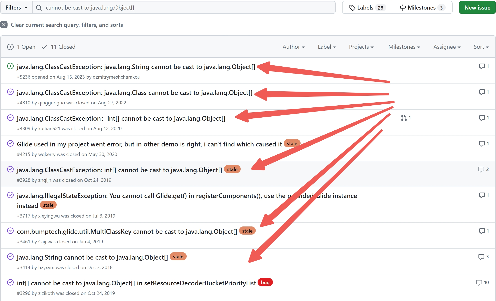
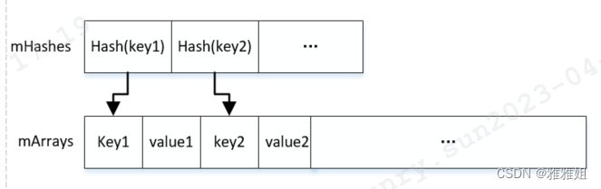
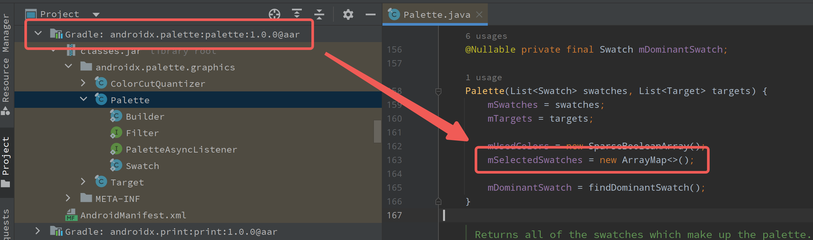

# Google 为何设计了如此难用的 ArrayMap 

## 一、概述

> **天下苦 `ArrayMap` 久矣。**

这并非 **哗众取宠**，如果有幸翻阅了 `Glide` 的代码仓库，你会在 [issues](https://github.com/bumptech/glide/issues?q=cannot+be+cast+to+java.lang.Object%5B%5D) 中发现在一堆奇怪的 `ClassCastException`:



难以置信，一个 `2018` 年的问题，历经 `6` 年`Glide` 官方仍然未解决。最近笔者线上发现了类似的崩溃，经过排查，崩溃原因竟然和业务代码或 `Glide`本身 **毫无关系**——其根本原因，是源自 `Google` 官方的 `ArrayMap` 的设计缺陷，并且从 `Android 8.0` 保留至今仍未修复。

> 当前最新版本（2024-08发布）：'androidx.collection:collection:1.4.3'

本文针对 `ArrayMap` 的设计理念和实现历程进行一个简单的回顾，最终回答以下几个问题：

* `ArrayMap` 初衷是为了解决什么问题？
* `ArrayMap` 的设计缺陷是什么，如何正确使用？
* `ArrayMap` 和 `HashMap` 的对比，如何取舍？

## 二、设计与实现

`ArrayMap` 是官方提供的一种 **键值对集合** ，我们知道，虽然 `HashMap` 已经提供了足够高的读写效率，但这是基于较高的 **内存占用** 和 **垃圾回收频率** 实现的。

因此 `Google` 设计了 `ArrayMap` 解决这两个问题。

### 2.1 减少pc成本

> 本文不会对 `ArrayMap` 进行源码级的讲解，读者仅需梳理思路即可。

首先，`ArrayMap` 的思路是使用两个并列的数组来存储键值对，可以极大地减少内存分配的次数，降低垃圾回收的压力：

```java
public final class ArrayMap<K, V> implements Map<K, V> {
  int[] mHashes;
  Object[] mArray;
  int mSize;
}
```

简单介绍最重要的2个数组成员：

* mHashes: 整数数组，保存 `key` 的 `hashcode`
* mArray: 对象数组，顺序保存 `key-value`

借用网上图描述下：



### 2.2 减少内存占用

这很好理解，ArrayMap 内部结构简单，提供了更紧凑的数据结构，而非类似 `HashMap` 复杂的数据结构（链表或红黑树），因此在存储少量数据时，比 `HashMap` 更加节省内存。

### 2.3 较高的读写效率

解决了 `HashMap` 内存效率的问题，`ArrayMap` 还需要保证 **性能优势**，众所周知，平均情况下，`HashMap` 的查找、插入和删除操作时间复杂度是 `O(1)`。

`ArrayMap` 使用 **有序数组** 和 **二分查找** 来定位键值对：

* 若找到存在相同键的位置，那就直接覆盖值。
* 若未找到，则在插入键值对时动态调整数组并保持 **有序性**。

由于使用了二分查找，因此时间复杂度是 `O(log n)`，由于其使用场景为 **内存受限的小数据集操作**，因此对数级别的时间复杂度是可以接受的。

### 2.4 进一步优化

`ArrayMap` 使用场景通常数据很少，而为了进一步 **优化内存的分配和回收**，其内部引入了 **缓存池** 概念：

```java
public final class ArrayMap<K, V> implements Map<K, V> {
  static Object[] mBaseCache;
  static Object[] mTwiceBaseCache;
}
```

简而言之，其内部使用一个 **静态缓存池** 存储已被回收但还可重用的内部存储结构。这包括一组预先定义的对象缓存队列，用来存储不同大小的数组。

当需要分配新的数组时，首先尝试从缓存中获取，而不是直接进行新的内存分配：

```java
private void allocArrays(int size) {
  if (size == BASE_SIZE) {
      synchronized (sBaseCacheLock) {
          if (mBaseCache != null) {
              // 1.从静态缓存池中取出
              final Object[] array = mBaseCache;
              // 2.复用之
              mArray = array;
              mBaseCache = (Object[]) array[0];   // 【重要】3.3 会讲
              mHashes = (int[]) array[1];
              if (mHashes != null) {
                  array[0] = array[1] = null;
                  mBaseCacheSize--;
                  if (DEBUG) {
                      Log.d(TAG, "Retrieving 1x cache " + mHashes
                              + " now have " + mBaseCacheSize + " entries");
                  }
                  return;
              }
              mBaseCache = null;
              mBaseCacheSize = 0;
          }
      }
    }
    // 3. 无可用缓存，再new
    mKeys = new Object[size];
    mValues = new Object[size];
}
```

迄今为止，`ArrayMap` 为我们呈现了 `Google` 设计人员极致的优化追求，以进一步提升在 `Android` 内存受限环境下的性能。

## 三、缺陷

### 3.1 线上的奇怪崩溃

使用`ArrayMap` 一段时间后，线上逐渐出现越来越多奇怪的 **崩溃**：

```java
java.lang.ClassCastException: java.lang.String cannot be cast to java.lang.Object[]
    at androidx.collection.SimpleArrayMap.allocArrays(SimpleArrayMap.java:184)
    at androidx.collection.SimpleArrayMap.put(SimpleArrayMap.java:458)
    at com.bumptech.glide.util.CachedHashCodeArrayMap.put(CachedHashCodeArrayMap.java:34)
    at com.bumptech.glide.request.BaseRequestOptions.transform(BaseRequestOptions.java:1017)
    at com.bumptech.glide.request.BaseRequestOptions.transform(BaseRequestOptions.java:971)
```

令人摸不到头脑的日志，来看崩溃的业务代码：

```java
GlideApp.with(context).load(path).transform(xxx).into(imageView);
```

有点更蒙圈了，自测几乎无法复现，这到底什么情况？

于是 `Glide` 官方仓库的 `issues` 中出现了若干类似的反馈。

### 3.2 超级不安全

崩溃的根本原因在于 `ArrayMap` 本身的 **线程不安全**。

请注意，这里还有点特殊，我们知道 `HashMap` 本身也是线程不安全的，但通常只是指 **对象本身的线程不安全**：并发场景下，只影响到单个对象，对其它场景的 `HashMap` 实例及内部数据是没有影响的。

 `ArrayMap` 就厉害了，并发场景下，一个数据异常，会影响到其它场景的其它 `ArrayMap` 实例。
 
 笔者词穷，确需一个词描述以区分`ArrayMap`，那就是 **线程超级不安全** 。
 
具体流程可靠参考 2.4 小节的源码，当并发场景下，缓存池内的数据有可能会收到污染，代码执行顺序如下：

```java
// SimpleArrayMap.java
private void allocArrays(int size) {
  // 省略其它
  
  // 1.从静态缓存池中取出
  final Object[] array = mBaseCache;
  // 2.复用之
  mArray = array;
  // *************************
  // 3.此时，其它线程进行了写操作，如 mArray.put(XXX)，即 mBaseCache 缓存池受到了污染.
  // *************************
  mBaseCache = (Object[]) array[0];   // 4.此时读取缓存池数据，脏数据导致类型异常，app崩溃
  
 // 省略其它
}
```
 
 需要强调的是，当 `mBaseCache` 缓存池受到污染后，可能并不会引起崩溃，而是把隐患埋了下来，当下一次，在其它业务场景下，通过 `new ArrayMap()` 创建对象并申请内存时，缓存池复用才会抛出异常。
 
 这也就解释了，为何 `Glide` 会在极度偶现的场景下崩溃，其本质可能是由于其它线程使用 `ArrayMap` 引起，只不过后续 `Glide` 加载图片时引爆了炸弹而已。

### 3.3 使用建议

由于 `frameWork`、`Glide`等框架内部依然大量使用了 `ArrayMap`, 作为开发者，我们仍需尽量避免类似问题的发生。

最好的方式是保证使用时的线程安全，即和 `Glide` 等源码保持一致，只在 **主线程使用** `ArrayMap` 及其子类。

### 3.4 躲都躲不掉

即使小心翼翼，正确线程的使用、甚至不使用`ArrayMap`，开发者仍然会遇到 `ArrayMap` 带来的崩溃问题：



如图，在 `androidx.palette` 官方的提色板组件中，`Palette` 实例的构建默认是通过 `AsyncTask` 创建在子线程中的，而内部的 `ArrayMap` 也自然在子线程中创建，因此也会导致上文中的崩溃问题。

读到这里，即使开发者业务中从未使用 `ArrayMap`，仍很难避免 **三方库** 甚至 **官方库** 内部`ArrayMap`的错误使用导致的崩溃。

笔者不禁疑惑，至此，`ArrayMap` 中的缓存池设计真的合理吗，如果不合理，为何其所在的 `androidx.collection` 库一直对该问题视而不见呢？

> `Google` 并非没发现这个问题，在后续的版本中， `Android SDK` 的 `ArrayMap` 源码中引入了对象锁和 `try-catch` 机制，对 `ClassCastException` 进行了捕获，但截止 24年8月发布的最新 1.4.3版本的 `androidx.collection` 组件，其内部的 `ArrayMap` 仍未修复。

## 小结

`ArrayMap` 设计的初衷是为了提高在 **内存受限环境下** 的 **小数据集操作** 的内存效率和性能，大量的官方、三方源码中都有应用。

遗憾的是，`ArrayMap` **线程超级不安全**，尽量在主线程使用，避免子线程使用引起崩溃。

进一步的，考虑到这个类并不是那么好用，且该类崩溃问题不易定位问题原因。普通业务场景下，笔者还是倾向`HashMap`。


---
## 关于我

Hello，我是 [却把清梅嗅](https://github.com/qingmei2) ，如果您觉得文章对您有价值，欢迎 ❤️，也欢迎关注我的 [博客](https://blog.csdn.net/mq2553299) 或者 [GitHub](https://github.com/qingmei2)。

*   [我的Android学习体系](https://github.com/qingmei2/blogs)
*   [关于文章纠错](https://github.com/qingmei2/blogs/blob/main/error_collection.md)
*   [关于知识付费](https://github.com/qingmei2/blogs/blob/main/appreciation.md)
*   [关于“断更很久”的《反思》系列](https://github.com/qingmei2/blogs/blob/main/src/%E5%8F%8D%E6%80%9D%E7%B3%BB%E5%88%97/thinking_in_android_index.md)