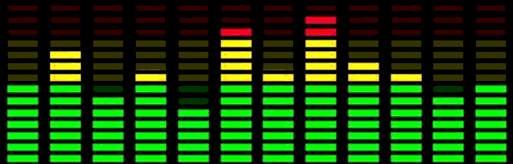
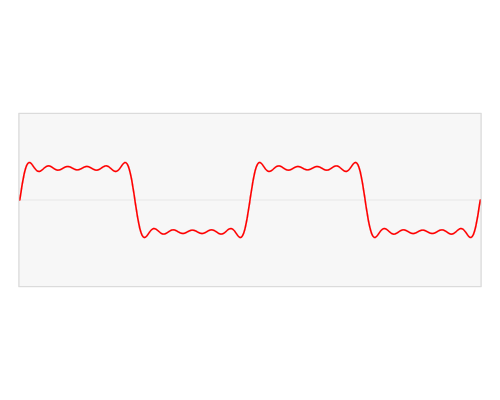
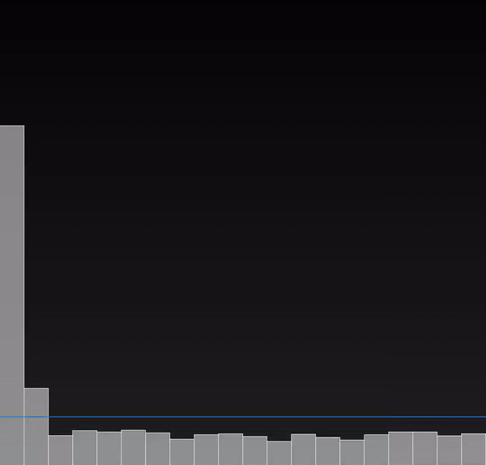
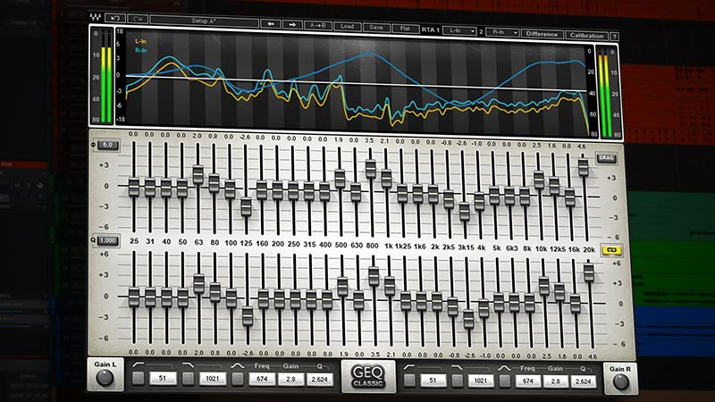
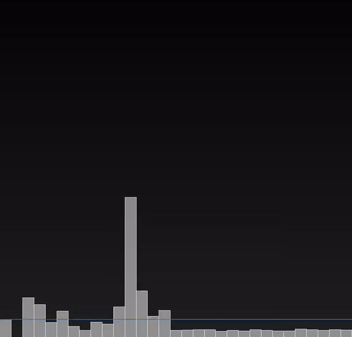
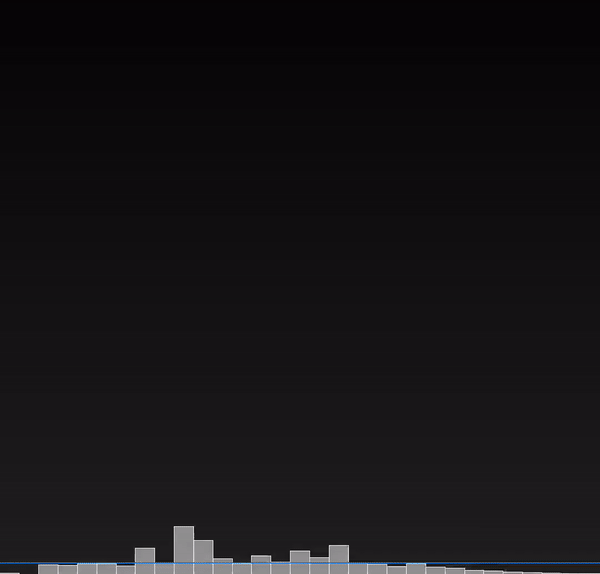

# [译] Android Visualizer 可视化器的自定义实现

> 原文：[An alternative Android Visualizer](https://www.egeniq.com/blog/alternative-android-visualizer)  
> 作者：[Dániel Zolnai](https://www.egeniq.com/blog/alternative-android-visualizer)  
> 译者：[却把清梅嗅](https://github.com/qingmei2)  

听音乐时，有时你会看到那些视觉上令人愉悦的跃动条，它们音量越大跳得越高。通常，左边的条形对应的频率较低（低音），而右边的条形对应较高的频率（高音）：



这些跃动条通常被称为 **视觉均衡器** 或 **可视化器**，若想在 `Android` 应用中展示类似的可视化效果，你可以使用 `Android` 原生的 `Visualizer` 类，它是`Android`框架中的一部分，且能够附加到你的 `AudioTrack`。

它是切实有效的，但有一个重要的缺陷：它需要申请 **麦克风权限** ，而从官方文档上来看，这是有确切考虑的：

> To protect privacy of certain audio data (e.g voice mail) the use of the visualizer requires the permission.
>
>为了保护某些音频数据（例如语音邮件）的隐私，使用 `Visualizer` 需要获取权限。

问题是，用户不会允许音乐 `APP` 申请使用他们的麦克风权限（这毫无疑问）。而当我翻遍了 `Android` 官方提供的`API`或者其他三方库，却找不到实现这样 **可视化器** 效果的替代方案。

因此我考虑自己造轮子，第一个问题是，我需要思考如何将正在播放的音乐，转换成每个跳跃条对应的高度。

## 可视化器的工作原理

首先，让我们从输入开始。当数字化音频时，我们通常会对信号幅度进行非常频繁的采样，这称为**脉冲编码调制** (PCM)。振幅随之被量化，我们将其表示到我们自己的 **数字标度** 上。

举个例子，如果编码是 `PCM-16`，这个比例将是 `16 bit`，我们可在 `2` 的 `16` 次幂的数字范围内表示一个幅度，即 `65536` 个不同的幅度值。

如果您在多个 `channel` 上采样（如立体声，分别录制左右声道），这些幅度会相互跟随，因此首先是 `channel 0` 的幅度，然后是 `channel 1` 的幅度，然后是 `channel 0`，依此类推。 一旦我们获得了这些幅度值作为原始数据，我们就可以继续下一步。 为此，我们需要了解声音实际上是什么：

> 我们听到的声音是物体振动的结果。例如人的声带、吉他的金属弦和木琴身。一般情况下，若不受特定声音振动的影响，空气分子会随机移动。  
>  
> 选自[《 Digital Sound and Music 》](http://digitalsoundandmusic.com/2-1-1-sound-waves-sine-waves-and-harmonic-motion/)

当敲击音叉时，它会以非常特定的 `440 次/秒 (Hz)` 振动，这种振动将通过空气传播到耳膜，在那里以相同的频率共振，大脑会将其解释为音符A。

在 `PCM` 中，这可以表示为正弦波，每秒重复 `440` 次。这些波的高度不会改变音符，但它们代表振幅；通俗点说，就是当听到它时，你耳朵里的响度。

但是当听音乐时，通常不仅有正在听的`音符A`（虽然我希望这样），而且还有过多的乐器和声音，从而导致 `PCM` 图形对人眼没有意义。实际上它是不同频率和振幅的不同正弦波大量振动的组合。

即使是非常简单的 `PCM` 信号（例如方波）在解构为不同的正弦波时也非常复杂：



> 方波解构为近似正弦和余弦波，参考自 [这里](https://visualizingmath.tumblr.com/post/63962473846/1ucasvb-the-fourier-transform-takes-an-input) 。

幸运的是，我们有算法来进行这种解构，我们称之为 **傅立叶变换** 。正如上文可视化器所展示的，它实际上是从正弦波和余弦波的组合中解构而出的。余弦基本上是一个 **延迟** 的正弦波，但是在这个算法中拥有它们非常有用，否则我们将无法为点 `0` 创建一个值，因为每个正弦波都是从 `0` 开始的，相乘仍然会得到 `0`。

执行 **傅里叶变换** 的算法之一是 **快速傅里叶变换 ( FFT )**。 在我们的 `PCM` 声音数据上运行此 `FFT` 算法时，我们将获得每个正弦波的幅度列表。这些波是声音的频率。在列表的开头，我们可以找到低频（低音），最后是高频（高音）。

这样，我们通过绘制一个这样的条形图，其高度由每个频率的幅度决定——我们得到了我们想要的可视化器。

## 技术实现

现在回到 `Android`。 首先，我们需要音频的 `PCM` 数据。 为此，我们可以将 `AudioProcessor` 配置给到我们的 `ExoPlayer` 实例，它会在转发之前接收每个音频字节。您还可以进行修改，例如更改 **幅度** 或 **过滤通道**，但不是现在。

```Kotlin
private val fftAudioProcessor = FFTAudioProcessor()

val renderersFactory = object : DefaultRenderersFactory(this) {
    override fun buildAudioProcessors(): Array<AudioProcessor> {
        val processors = super.buildAudioProcessors()
        return processors + fftAudioProcessor
    }
}
player = ExoPlayerFactory.newSimpleInstance(this, renderersFactory, DefaultTrackSelector())
```

在 `queueInput(inputBuffer: ByteBuffer)` 方法中，我们将收到捆在一起作为一帧的 `byte` 数据。

这些 `byte` 可能来自多个 `channel`，为此我取了所有 `channel` 的平均值，并且仅将其转发以进行处理。

为了使用 **傅立叶变换**，我使用了 [Noise](https://github.com/paramsen/noise) 库。变换需要一个具有给定样本大小的`float`列表。样本大小应该是 `2` 的因子，我选择了 `4096`。

增加这个数字可获得更精细的数据，但计算时间更长，计算也更不频繁（因为可针对每 `X` 字节的声音数据进行一次更新，其中 `X` 是样本大小）。如果数据是 `PCM-16`，则 `2` 个字节构成一个幅度。浮点值并不重要，因为它们可以缩放。如果您提交一个介于 `0` 和 `1` 之间的数字，则结果都将介于 `0` 和 `1` 之间（因为无需将正弦波幅度与更高的数字相乘）。

所得结果也将是一个`float`列表。我们可使用这些频率立即绘制 `4096` 个条形图，但这不切实际。

来看看如何改进这些结果数据。

## 频段

首先，我们可以将这些频率组合成更小的组。因此，假设我们将 `0-20kHz` 频谱划分为 `20` 个小节，每个小节跨越 `1kHz`。

`20` 条比 `4096` 条更容易绘制，我们也无需那么多条。如果现在绘制这些值，可以看到，只有最左边的部分在大幅度移动。



这是因为音乐中频率的适用范围大约是 `20-5000Hz`，而听`10kHz`的声音会让人很烦躁。若将音乐中的较高频率排除在外，你会注意到，它听起来会越来越沉闷，但与较低频率相比，这些频率的幅度非常小。

如果你看过录音室均衡器，则会发现频段也分布不均，频率的下半部分通常占用 `80-90%` 的频段：



鉴于此，建议通过为较低频率分配更多频带来使这些频带具有可变宽度。下图是这样做的效果，它看起来会好一些：



似乎不错，但仍然存在 `2` 个问题：

首先，右边的频率似乎移动得有点太多了。这是因为我们的采样并不完美，它引入了称为 **频谱泄漏** 的伪像，其中原始频率会涂抹到相邻的频率中。为了减少这种拖尾现象，我们可以应用一个窗口函数，在那里我们突出我们感兴趣的频率并调低其他频率。这些窗口有不同类型，但我将使用 **汉明窗口** (`Hamming-window`)。我们感兴趣的频率是中间的频段，并针对两端进行抑制:



最后，还有一个小问题，这在上面的 `gif` 中无法体现，但当听音乐时会立即注意到：条跃动太早了，它们在你意料不到的时候跃动起来。

## 意外缓冲区

这种不同步的行为是因为在 `ExoPlayer AudioProcessor` 中，我们在数据传递到 `AudioTrack` 之前接收到数据，而 `AudioTrack` 有自己的缓冲区，这会导致视觉效果领先于音频效果，导致延迟输出。

对此的解决方案是将 `ExoPlayer` 缓冲区大小计算部分的代码进行复制，因此我的 `AudioProcessor` 中的缓冲区大小与 `AudioTrack` 完全相同。

我将传入的字节放在缓冲区的末尾，只处理缓冲区开头的字节（`FIFO` 队列），我如愿以偿延迟了 `FFT`。

## 最终效果

我创建了一个 [代码仓库](https://github.com/dzolnai/ExoVisualizer)，这上面，我通过播放在线广播并使用我创建的可视化器进行绘图，以展示我的 `FFT` 处理器。它肯定不能直接用于线上产品，但如果您正在为音乐`APP`寻找可视化工具，它会提供一个很好的基础。