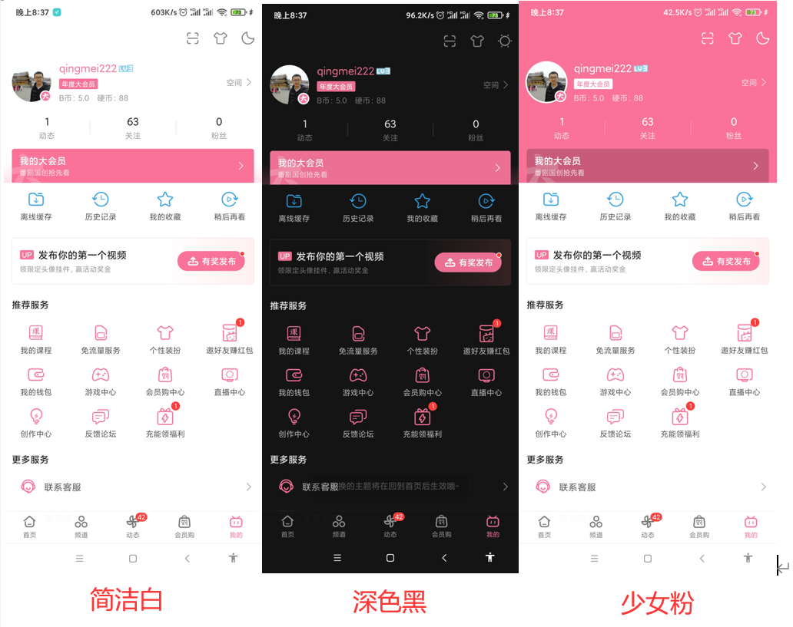

# 反思 | 开启B站少女心模式，探究APP换肤机制的设计与实现

## 概述

**换肤功能** 并非奇技淫巧，尤其当`Android Q`推出了 **黑暗模式** 之后，国内绝大多数主流应用都至少提供了 **日间** 和 **夜间** 两种模式。

对于无感的用户而言，这个功能实属鸡肋，但从另外一个角度上来说，这也是产品在雕琢 **用户极致体验** 过程中的一次尝试，为不同情景下，不同偏好的用户提供更多的选择性。

以 **哔哩哔哩** 为例，除了提供以上两种主题之外，还免费提供了充满 **少女心** 的粉色主题：

从产品的前瞻性上来看，国内在换肤功能的探索较国外是领先的，抽象的来看待`Android Q`的 **黑暗模式**，也无非是新增一种主题罢了，因此，开发者应该将角度放在更高的层级上：**为产品提供一套完善的换肤方案**，而非仅仅是  **适配AndroidQ的黑暗模式** 。

想清楚这一点，开发者就不会将目光仅局限于技术本身——对于整个换肤体系而言，涵盖了UI、产品、开发、测试、运维等多名角色不同的关注点，而这些关注点最终却都依赖研发协助做决策，举例如下：

* **UI**：定义不同的UI组件不同的颜色属性，这些属性最终在不同的主题下，代表不同的颜色（日间模式下标题是黑色，但是夜间模式下，标题应该是白色）。
* **产品**：定义换肤功能的业务流程，从简单的换肤主页，换肤的交互，到不同主题下的不同展示、付费策略等等。
* **开发**：提供换肤功能的研发能力。
* **测试**：保证换肤功能的稳定性，比如自动化测试和便捷取色工具。
* **运维**：保证线上问题的快速定位和及时解决。

除此之外，还有更多可以深入思考的技术点，比如，随着主题越来越多，势必导致`APK`包体积的增大，是否有必要引入远程动态加载（`download & install`）的能力？借助不同角色的视角，我们可以提前规划好远景，接下来的编码也就更加遂心应手了。

本文将针对 `Android` 应用整个换肤体系进行概括性的描述，读者应抛开对 **技术实现的细节** 的执著，从不同角色的需求去思考，**窥一斑而知全豹** ，从而为产品打造出健壮有力的功能实现。

## 定义规范

## 换肤功能的核心实现：LayoutInflater.Factory2

###

读者应该知道，
