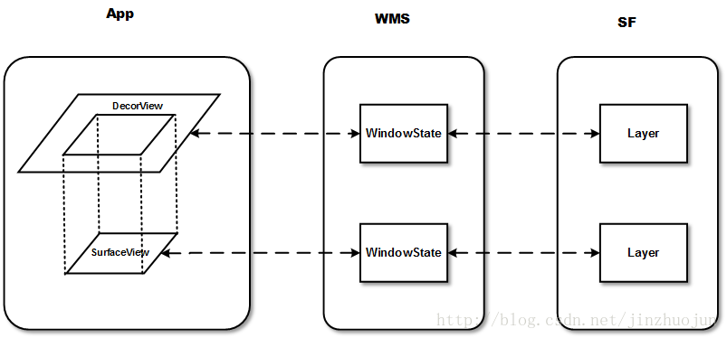

# 反思: Google 为何把 SurfaceView 设计的这么难用？

> **反思** 系列博客是历经验证得出的一种 **"极度内卷"** ，但却 **效果显著** 的学习方式，该系列起源和目录请参考 [这里](https://github.com/qingmei2/blogs/blob/master/src/%E5%8F%8D%E6%80%9D%E7%B3%BB%E5%88%97/thinking_in_android_index.md) 。

## 启程

如果你有过 `SurfaceView` 的使用经历，那么你一定和我一样，曾经被它所引发出 **层出不穷的异状** 折磨的 **怀疑人生**—— 毕竟，作为一个有理想的开发者，在深入了解 `SurfaceView` 之前，你很难想通这样一个问题：

> 为什么 `Google` 把 `SurfaceView` 设计的这么难用？
* 不支持 `transform` 动画；
* 不支持半透明混合；
* 移动，大小改变，隐藏/显示操作引发的各种问题；

另一方面，即使你对 `SurfaceView` 使用不多，**图形系统** 的这朵乌云依然笼罩在每一位 `Android` 开发者的头顶，来看 `Google` 对其的 [描述](https://source.android.com/docs/core/graphics/architecture)：


最终我尝试走近这片迷雾，并一点点去思考下列问题的答案：

* 1. `SurfaceView` 的设计初衷是为了解决什么问题？  
* 2. 实际开发中，`SurfaceView` 这么 **难用** 的根本原因是什么？  
* 3. 为了解决这些问题，`Google` 的工程师进行了哪些 **尝试** ？

接下来，读者可带着这些问题，跟随笔者一起，再次回顾 `SurfaceView` 设计和实现的精彩历程。

## 一、世界观

在了解 `SurfaceView` 的设计初衷之前，读者首先需要对 `Android` 现有的图形架构有一个基本的了解。

`Android` 系统采用一种称为 `Surface` 的图形架构，简而言之，每一个 `Activity` 都关联有至少一个 `Window`（窗口），每一个 `Window` 都对应有一个 `Surface`。

`Surface` 这里直译过来叫做 **绘图表面** ，顾名思义，其可在内存中生成一个图形缓冲区队列，用于描述 `UI`，经与系统服务的`WindowServiceManager` 通信后、通过 `SurfaceFlinger` 服务持续合成并送显到显示屏。

读者可通过下图，在印象上对整个流程建立一个简单的轮廓：


由此可见，通常情况下，一个 `Activity` 的 `UI` 渲染本质是 **系统提供一块内存，并创建一个图形缓冲区进行维护**；这块内存就是 `Surface`，最终页面所有 `View` 的 `UI` 状态数据，都会被填充到同一个 `Surface` 中。

截至目前一切正常，但需要指出的是，现有图形系统的架构设计中还藏了一个线程相关的 **隐患** 。

## 二、设计起源

### 1.线程问题

问题点在于：我们还需保证 `Surface` 内部 `Buffer` 缓冲区的 **线程安全**。

这样的描述，对于读者似乎太过飘渺，但从结论来说，最终，一条 `Android`开发者 **耳熟能详** 的规则因此而诞生：

 **主线程不能执行耗时操作**。

我们知道， `UI` 的所有操作，一定会涉及到视图（`View` 树) 内部大量状态的维护，而 `Surface` 内部的缓冲区也会不断地被读写，并交给系统渲染。因此，如果 `UI` 相关的操作，放在不同的线程中执行，而多线程对这一块内存区域的读写，势必会引发内部状态的混乱。

为了避免这个问题，设计者就需要通过某种手段保证线程同步（比如加锁），而这种同步所带来的巨大开销，对于开发者而言，是不可接受的。

因此，最合理的方案就是保证所有`UI`相关操作都在同一个线程，而这个线程也被称作 **主线程** 或 `UI` 线程。

现在，我们将`UI`操作限制到主线程去执行，以解决了本小节开始时提到的线程问题，但开发者仍需小心—— 众所周知，主线程除了执行`UI`相关的操作之外，还负责接收各种各样的 **输入事件**（比如触摸、按键等），因此，为了保证用户的输入事件能够及时得到响应，我们就要保证 `UI` 操作的 **稳定高效**，尽可能避免耗时的 `UI` 操作。

### 2.动机

挑战随之而来。

当渲染的缓冲数据来自外部的其它系统服务或`API`时——比如系统媒体解码器的音视频数据，或者 `Camera API` 的相机数据等，这时 `UI` 渲染的效率要求会变得非常高。

开发者有了新的诉求：能否有这样一种特殊的视图，它拥有独立的 `Surface` ，这样就可以脱离现有 `Activity` 宿主的限制，在一个独立的线程中进行绘制。

**由于该视图不会占用主线程资源，一方面可以实现复杂而高效的 `UI` 渲染，另一方面可以及时响应用户其它输入事件**。

因此，`SurfaceView` 应运而生：与常规视图控件不同，`SurfaceView` 拥有独立的 `Surface`，如果我们将一个 `Surface` 理解为一个层级 （`Layer`)，最终 `SurfaceFlinger` 会将前后两者的`2`个 `Layer` 进行 **合成** 和 **渲染** ：


现在，我们引用官方文档的描述，再次重申适用 `SurfaceView` 的场景：

> 在需要渲染到单独的 `Surface`（例如，使用 `Camera API` 或 `OpenGL ES` 上下文进行渲染）时，使用 `SurfaceView` 进行渲染很有帮助。使用 `SurfaceView` 进行渲染时，`SurfaceFlinger` 会直接将缓冲区合成到屏幕上。
> 
> 如果没有 `SurfaceView`，您需要将缓冲区合成到屏幕外的 `Surface`，然后该 `Surface` 会合成到屏幕上，而使用 `SurfaceView` 进行渲染可以省去额外的工作。

### 3.具体思路

根据当前的设想，我们针对  **SurfaceView**  设计思路进行细化。

首先，我们需对现有的视图树结构进行改造。为了便于使用，我们允许开发者将 `SurfaceView` 直接加入到现有的视图树中（即作为控件，它受限于宿主 `View Hierachy`的结构关系），但在系统服务端中，对于 `SurfaceFlinger` 而言，`SurfaceView` 又是完全与宿主完全分离开的：



在上图中，我们可以看到，在 `z` 轴上，`SurfaceView` 默认是低于 `DecorView` 的，也就是说，`SurfaceView` 通常总是处于当前页面的最下方。

这似乎有些违反直觉，但仔细考虑 `SurfaceView` 的应用场景，无论是 `Camera` 相机应用、音视频播放页，亦或者是渲染游戏画面等，`SurfaceView` 承载的画面似乎总应该在页面的最下面。

实际设计中也是如此，用来描述 `SurfaceView` 的 `Layer` 或者 `LayerBuffer` 的 `z` 轴位置默认是低于宿主窗口的。与此同时，为了便于最底层的视图可见， `SurfaceView` 在宿主 `Activity` 的窗口上设置了一块透明区域（**挖了一个洞**）。

最终，`SurfaceFlinger` 把所有的 `Layer` 通过用统一流程来绘制和合成对应的 `UI`。

在整个过程中，我们需更进一步深入研究几个细节：

1. `SurfaceView` 与宿主视图树结构的关系，以及 **挖洞** 过程的实现；
2. `SurfaceView` 与系统服务的通信创建 `Surface`的实现；
3. `SurfaceView` 具体绘制流程的实现。

## 三、施工

### 1. 视图树与挖洞

一句话总结 `SurfaceView` 与视图树的关系： **在视图树内部，但又没完全在内部** 。

首先，`SurfaceView` 的设计依然遵循 `Android` 的 `View` 体系，继承了 `View`，这意味着使用时，它可以声明在 `xml` 布局文件中：

```java
// /frameworks/base/core/java/android/view/SurfaceView.java
public class SurfaceView extends View  { }
```

> 出于安全性的考量，`SurfaceView` 相关源码并未直接开放出来，开发者只能看到自动生成的一个接口类，源码可以借助梯子在 [这里](http://aospxref.com/android-10.0.0_r47/xref/frameworks/base/core/java/android/view/SurfaceView.java) 查阅。

`LayoutInflater` 布局填充阶段，按既有的布局填充流程，将 `SurfaceView` 构造并加入到视图树的某个结点；接下来，根布局会通过深度遍历依次执行 `onAttachedToWindow()` 处理视图挂载窗口的事件：

```java
// /frameworks/base/core/java/android/view/SurfaceView.java
@Override
protected void onAttachedToWindow() {
    // ...
    mParent.requestTransparentRegion(SurfaceView.this);   // 1.
    ViewTreeObserver observer = getViewTreeObserver();
    observer.addOnPreDrawListener(mDrawListener);         // 2.
}

@UnsupportedAppUsage
private final ViewTreeObserver.OnPreDrawListener mDrawListener = new ViewTreeObserver.OnPreDrawListener() {
    @Override
    public boolean onPreDraw() {
        updateSurface();                                 // 3.
        return true;
    }
};

protected void updateSurface() {
  // ...
  mSurfaceSession = new SurfaceSession();
  mSurfaceControl = new SurfaceControl.Builder(mSurfaceSession);    // 4
  //...
}
```

步骤 `1` 中，`SurfaceView` 会向父视图依次向上请求创造一份透明区域，根视图统计到最终的信息后，通过 `Binder` 通知 `WindowManagerService` 将对应区域设置为透明。

步骤 `2、3、4` 是在同一个方法的调用栈中，由此可见，`SurfaceView` 向系统请求透明区域后，会立即创建一个与绘图表面的连接 `SurfaceSession` ，并创建一个对应的控制器 `SurfaceControl`，便于对这个独立的绘图表面进行直接通信。

由此可见，`Android` 自有的视图树体系中，`SurfaceView` 作为一个普通的 `View` 被挂载上去之后，通过 `Binder` 通信，`WindowManagerService` 将其所在区域设置为透明（挖洞）；并建立了与独立绘图表面的连接，后续便可与其直接通信。

### 2. 子图层类型

在阐述绘制流程之前，读者需简单了解 **子图层类型** 的概念。

上文说到，`SurfaceView` 的绝大多数使用场景中，其 `z` 轴的位置通常是在页面的 **最下方** 。但在实际开发中，随着业务场景复杂度的上升，仍然有部分场景是无法被满足的，比如：在页面的最上方播放一条全屏的视频广告。

因此，`SurfaceView` 的设计中引入了一个 **子图层类型** 的概念，用于定义这个独立的 `Surface` 相比较当前页面窗口 (即`Activity`) 的位置：

```java
// /frameworks/base/core/java/android/view/SurfaceView.java
public class SurfaceView extends View {
  
  // SurfaceView 的子图层类型
  int mSubLayer = APPLICATION_MEDIA_SUBLAYER;
  
  // SurfaceView 是否展示在当前窗口的最上方
  // 该方法在挖洞和绘制流程中都有使用，最终影响到用户的视觉效果
  private boolean isAboveParent() {
    return mSubLayer >= 0;
  }
}

// /frameworks/base/core/java/android/view/WindowManagerPolicyConstants.java
public interface WindowManagerPolicyConstants {
  // ...
  int APPLICATION_MEDIA_SUBLAYER = -2;
  int APPLICATION_MEDIA_OVERLAY_SUBLAYER = -1;
  int APPLICATION_PANEL_SUBLAYER = 1;
  int APPLICATION_SUB_PANEL_SUBLAYER = 2;
  int APPLICATION_ABOVE_SUB_PANEL_SUBLAYER = 3; 
  // ...
}
```

如代码所示，`mSubLayer` 默认值为 `-2`，这表示 `SurfaceView` 默认总是在 `Activity` 的下方，想要让 `SurfaceView` 展示在 `Activity` 上方，可以调用 `setZOrderOnTop(true)` 以修改 `mSubLayer` 的值:

```java
// /frameworks/base/core/java/android/view/SurfaceView.java
public class SurfaceView extends View {
  
  public void setZOrderOnTop(boolean onTop) {
      if (onTop) {
          mSubLayer = APPLICATION_PANEL_SUBLAYER;
      } else {
          mSubLayer = APPLICATION_MEDIA_SUBLAYER;
      }
  }
  
  public void setZOrderMediaOverlay(boolean isMediaOverlay) {
    mSubLayer = isMediaOverlay ? APPLICATION_MEDIA_OVERLAY_SUBLAYER : APPLICATION_MEDIA_SUBLAYER;
  }
}
```

现在，无论是将 `SurfaceView` 放在页面的上方还是下方，都轻而易举。
 
但这仍然无法满足所有诉求，比如针对具有 `alpha` 通道的透明视频进行渲染时，产品希望其所在的图层位置能够更灵活（在两个 `View` 之间），但由于 `SurfaceView` 自身设计的原因，其并无法与视图树融合，这也正是 `SurfaceView` 饱受诟病的主要原因之一。

通过辩证的观点来看， `SurfaceView` 的这种设计虽然满足不了严苛的业务诉求，但在绝大多数场景下，**独立绘图表面** 这种设计都能够保证足够的渲染性能，同时不影响主线程输入事件的处理，绝对是一个优秀的设计。

### 3.子图层类型-插曲

值得一提的是，在 `SurfaceView` 的设计中，设计者还考虑到了音视频渲染时，字幕相关业务的场景，因此额外提供了一个 `setZOrderMediaOverlay()` 方法：

```java
// /frameworks/base/core/java/android/view/SurfaceView.java
public class SurfaceView extends View {
  public void setZOrderMediaOverlay(boolean isMediaOverlay) {
    mSubLayer = isMediaOverlay ? APPLICATION_MEDIA_OVERLAY_SUBLAYER : APPLICATION_MEDIA_SUBLAYER;
  }
}
```

该方法的设计说明了`2`点：

首先，由于 `APPLICATION_MEDIA_SUBLAYER` 和 `APPLICATION_MEDIA_OVERLAY_SUBLAYER` 都小于`0`，因此，无论如何，字幕始终被渲染在页面的下方。又因为视频理应渲染在字幕的下方，所以 **不推荐** 开发者在使用 `SurfaceView` 渲染视频时调用 `setZOrderOnTop(true)`，将视频放在页面视图的顶层。

其次，同时具有 `setZOrderOnTop()` 和 `setZOrderMediaOverlay()` 方法，显然是提供给两个不同 `SurfaceView` 分别使用的，以定义不同的渲染层级，因此同一个页面存在多个 `SurfaceView` 是正常的，开发者完全可以根据业务场景，合理运用。

### 4. 令人头大的黑屏问题

在使用 `SurfaceView` 的过程中，笔者最终也遇到了 **默认黑屏** 的问题：

由于视频本身的加载和编解码的耗时，用户总是会先看到 `SurfaceView` 的黑色背景一闪而过，然后视频才开始播放的情况，对于产品而言，这种交互体验是 **不可容忍** 的。

通过上文读者知道，`SurfaceView` 拥有独立的绘制表面，因此常规对付 `View` 的一些手段——比如 `setVisibility()` 、`setAlpha()` 、`setBackgroundColor()` 并不能解决上述问题；因此，想真正解决它，就必须先弄清楚 `SurfaceView` 底层的绘制流程。

`SurfaceView` 虽然特殊，但其作为视图树的一个结点，其依然参与到了视图树常规绘制流程，这里我们直接看 `SurfaceView` 的 `draw()` 方法：

```java
// /frameworks/base/core/java/android/view/SurfaceView.java
public class SurfaceView extends View {
  
  //...
  @Override
  public void draw(Canvas canvas) {
      if (mDrawFinished && !isAboveParent()) {             // 1.
          if ((mPrivateFlags & PFLAG_SKIP_DRAW) == 0) {
              clearSurfaceViewPort(canvas);
          }
      }
      super.draw(canvas);
  } 
  
  private void clearSurfaceViewPort(Canvas canvas) {
      // ...
      canvas.drawColor(0, PorterDuff.Mode.CLEAR);         // 2.
  }
}
```

由此可见，当满足 `!isAboveParent()` 的条件——即 `SurfaceView` 的子图层类型位于宿主视图的下方时，`SurfaceView` 默认会将绘图表面的颜色指定为黑色。

显然，该问题最简单的解决方式就是对源码进行`hook`或者反射，遗憾的是，上文我们也提到了，出于安全性的考量，`SurfaceView` 的源码是没有公开暴露的。

设计者其实也想到了这个问题，因此额外提供了一个 `SurfaceHolder` 的 `API` 接口，通过该接口，开发者可以直接拿到独立绘图表面的 `Canvas` 对象，以及对这个画布进行绘制操作：

```java
// /frameworks/base/core/java/android/view/SurfaceHolder.java
public interface SurfaceHolder {
  // ...
  public Canvas lockCanvas();
  
  public void unlockCanvasAndPost(Canvas canvas);
  //...
}
```

遗憾的是，即使拿到 `Canvas`，开发者仍然会受到限制：

```java
// /frameworks/base/core/java/com/android/internal/view/BaseSurfaceHolder.java
public abstract class BaseSurfaceHolder implements SurfaceHolder {
   
   private final Canvas internalLockCanvas(Rect dirty, boolean hardware) {
    if (mType == SURFACE_TYPE_PUSH_BUFFERS) {
        throw new BadSurfaceTypeException("Surface type is SURFACE_TYPE_PUSH_BUFFERS");
    }
    // ...
  }
}
```

这里的代码，笔者引用 [罗升阳](https://blog.csdn.net/luoshengyang/article/details/8744683) 的 [这篇文章](https://www.kancloud.cn/alex_wsc/androids/473787) 中的一段来解释：

> 注意，只有在一个 `SurfaceView` 的绘图表面的类型不是 `SURFACE_TYPE_PUSH_BUFFERS` 的时候，我们才可以自由地在上面绘制 `UI`。我们使用 `SurfaceView` 来显示摄像头预览或者播放视频时，一般就是会将它的绘图表面的类型设置为 `SURFACE_TYPE_PUSH_BUFFERS` 。在这种情况下，`SurfaceView` 的绘图表面所使用的图形缓冲区是完全由摄像头服务或者视频播放服务来提供的，因此，我们就不可以随意地去访问该图形缓冲区，而是要由摄像头服务或者视频播放服务来访问，因为该图形缓冲区有可能是在专门的硬件里面分配的。

由此可见，`SurfaceView` 黑屏问题的原因是综合且复杂的，无论是通过 `setZOrderOnTop()` 等方法设置为背景透明（但是会在页面层级的最上方），亦或者调整布局参数，都会有大大小小的一些问题。

## 小结

综合来看，`SurfaceView` 这些饱受争议的问题，从设计的角度来看，都是有其自身考量的。

而为了解决这些问题，官方后续提供了 `TextureView` 以替换 `SurfaceView`，`TextureView` 的原理是和 `View` 一样绘制到当前 `Activity` 的窗口上，因此不存在 `SurfaceView` 的这些问题。

换个角度来看，由于 `TextureView` 渲染依赖于主线程，因此也会导致了新的问题出现。除了性能比较 `SurfaceView` 会有明显下降外，还会有经常掉帧的问题，有机会笔者会另起一篇进行分享。

## 参考 & 感谢

> 细心的读者应该能够发现，关于 **参考&感谢** 一节，笔者着墨越来越多，原因无他，笔者 从不认为 一篇文章就能够讲一个知识体系讲解的面面俱到，本文亦如是。
>
>因此，读者应该有选择性查看其它优质内容的权利，甚至是为其增加一些简洁的介绍（因为标题大多都很相似），而不是文章末尾甩一堆 `https` 开头的链接不知所云。
>
>这也是对这些内容创作者的尊重，如果你喜欢本文，也同样希望你能够喜欢下面这些文章。

[1. Android源码-frameworks-SurfaceView](http://aospxref.com/android-10.0.0_r47/xref/frameworks/base/core/java/android/view/SurfaceView.java)  

阅读源码永远是学习最有效的方式，如果你想更进一步深入了解 `SurfaceView`，选它就对了。

[2. Android官方文档-图形架构](https://source.android.com/docs/core/graphics)  

遗憾的是，在笔者学习的过程中，官方文档并未给予到很大的帮助，相当一部分原因是因为文档中的内容太 **规范** 了，保持内容 **精炼** 且 **准确** 的同时，也增加了读者的理解成本。

但无论如何，作为权威的官方文档，仍适合作为复习资料，反复阅读。

[3. Android视图SurfaceView的实现原理分析 @罗升阳](https://www.kancloud.cn/alex_wsc/androids/473787)  

**神作，** 我认为它是 **最适合** 进阶学习和研究 `SurfaceView` 源码的文章。

[4. Android 5.0(Lollipop)中的SurfaceTexture，TextureView, SurfaceView和GLSurfaceView @ariesjzj](https://blog.csdn.net/jinzhuojun/article/details/44062175)  

在笔者摸索学习，困惑于标题中这些概念的阶段，本文以浅显易懂的方式对它们进行了简单的总结，推荐。


---

## 关于我

Hello，我是 [却把清梅嗅](https://github.com/qingmei2) ，如果您觉得文章写的很赞，欢迎 ❤️，如果您觉得文章更新太慢，欢迎通过  ❤️ 或者 **评论** 鼓励我写出更好的文章。

* [我的Android学习体系](https://github.com/qingmei2/blogs)
* [关于文章纠错](https://github.com/qingmei2/blogs/blob/master/error_collection.md)
* [关于知识付费](https://github.com/qingmei2/blogs/blob/master/appreciation.md)
* [关于《反思》系列](https://github.com/qingmei2/blogs/blob/master/src/%E5%8F%8D%E6%80%9D%E7%B3%BB%E5%88%97/thinking_in_android_index.md)