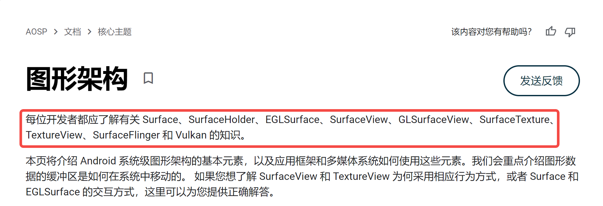
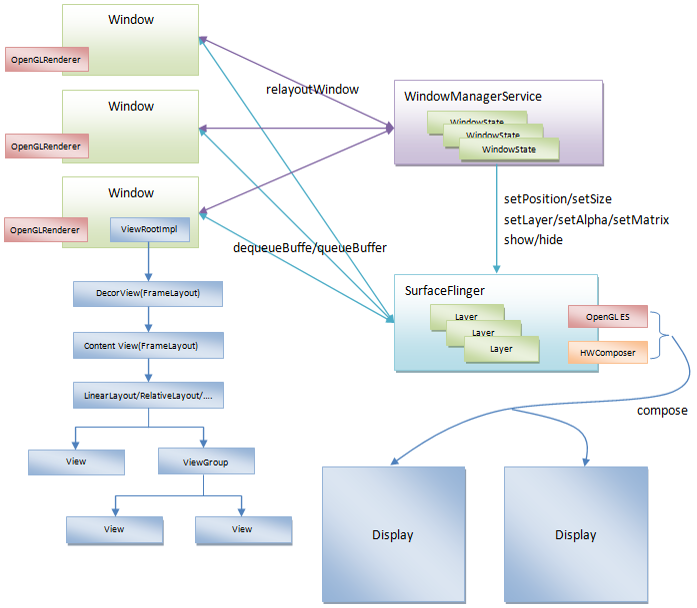

# 反思: Google 为何把 SurfaceView 设计的这么难用？

> **反思** 系列博客是历经验证得出的一种 **"极度内卷"** ，但却 **效果显著** 的学习方式，该系列起源和目录请参考 [这里](https://github.com/qingmei2/blogs/blob/master/src/%E5%8F%8D%E6%80%9D%E7%B3%BB%E5%88%97/thinking_in_android_index.md) 。

## 启程

如果你有过 `SurfaceView` 的使用经历，那么你一定和我一样，曾经被它所引发出 **层出不穷的异状** 折磨的 **怀疑人生**—— 毕竟，作为一个有理想的开发者，在深入了解 `SurfaceView` 之前，你很难想通这样一个问题：

> 为什么 `Google` 把 `SurfaceView` 设计的这么难用？

另一方面，即使你对 `SurfaceView` 使用不多，**图形系统** 的这朵乌云依然笼罩在每一位 `Android` 开发者的头顶，来看 `Google` 对其的 [描述](https://source.android.com/docs/core/graphics/architecture)：

最终我尝试走近这片迷雾，并一点点去思考下列问题的答案：

* 1. `SurfaceView` 的设计初衷是为了解决什么问题？  
* 2. 实际开发中，`SurfaceView` 这么 **难用** 的根本原因是什么？  
* 3. 为了解决这些问题，`Google` 的工程师进行了哪些 **尝试** ？

接下来，读者可带着这些问题，跟随笔者一起，再次回顾 `SurfaceView` 设计和实现的精彩历程。

## 一、世界观

在了解 `SurfaceView` 的设计初衷之前，读者首先需要对 `Android` 现有的图形架构有一个基本的了解。

`Android` 系统采用一种称为 `Surface` 的图形架构，简而言之，每一个 `Activity` 都关联有至少一个 `Window`（窗口），每一个 `Window` 都对应有一个 `Surface`。

`Surface` 这里直译过来叫做 **绘图表面** ，顾名思义，其可在内存中生成一个图形缓冲区队列，用于描述 `UI`，经与系统服务的`WindowServiceManager` 通信后、通过 `SurfaceFlinger` 服务持续合成并送显到显示屏。

读者可通过下图，在印象上对整个流程建立一个简单的轮廓：

由此可见，通常情况下，一个 `Activity` 的 `UI` 渲染本质是 **系统提供一块内存，并创建一个图形缓冲区进行维护**；这块内存就是 `Surface`，最终页面所有 `View` 的 `UI` 状态数据，都会被填充到同一个 `Surface` 中。

截至目前一切正常，但需要指出的是，现有图形系统的架构设计中还藏了一个线程相关的 **隐患** 。

## 二、线程问题与设计动机

问题点在于：我们还需保证 `Surface` 内部 `Buffer` 缓冲区的 **线程安全**。

这样的描述，对于读者似乎太过飘渺，但从结论来说，最终，一条 `Android`开发者 **耳熟能详** 的规则因此而诞生：

 **主线程不能执行耗时操作**。

我们知道， `UI` 的所有操作，一定会涉及到 `View` 树内部大量状态的维护，而 `Surface` 内部的缓冲区也会不断地被读写，并交给系统渲染。因此，如果 `UI` 相关的操作，放在不同的线程中执行，而多线程对这一块内存区域的读写，势必会引发内部状态的混乱。

为了避免这个问题，设计者就需要通过某种手段保证线程同步（比如加锁），而这种同步所带来的巨大开销，对于开发者而言，是不可接受的。

因此，最合理的方案就是保证所有`UI`相关操作都在同一个线程，而这个线程也被称作 **主线程** 或 `UI` 线程。

现在，我们将`UI`操作限制到主线程去执行，以解决了本小节开始时提到的线程问题，但开发者仍需小心—— 众所周知，主线程除了执行`UI`相关的操作之外，还负责接收各种各样的 **输入事件**（比如触摸、按键等），因此，为了保证用户的输入事件能够及时得到响应，我们就要保证 `UI` 操作的 **稳定高效**，尽可能避免耗时的 `UI` 操作。

新的挑战随之而来，当渲染的缓冲数据来自外部的其它系统服务或`API`时——比如系统媒体解码器的音视频数据，或者 `Camera API` 的相机数据等，这时 `UI` 渲染的效率要求会变得非常高。

开发者有了新的诉求：能否有这样一种特殊的视图，它拥有独立的 `Surface` ，这样就可以脱离现有 `Activity` 宿主的限制，在一个独立的线程中进行绘制。由于该视图不会占用主线程资源，一方面可以实现复杂而高效的 `UI` 渲染，另一方面可以及时响应用户其它输入事件。

`SurfaceView` 应运而生。与常规的 `View` 控件不同，`SurfaceView` 拥有独立的绘图表面，

  